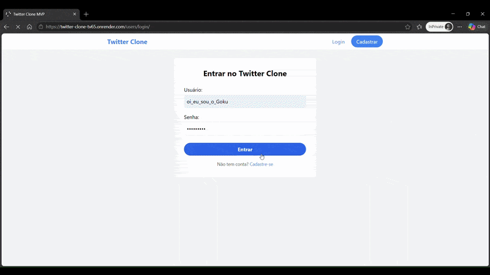

  

# 🐦 Twitter Clone MVP - Gustavo Inglez

Projeto desenvolvido para conclusão de módulo, focado em Full Stack Development com Django.

## 🚀 Tecnologias
- **Back-end:** Django 6.0 (Arquitetura Monolítica)
- **Armazenamento de Mídia:** Cloudinary (Integração Direta via `CloudinaryField`)
- **Front-end:** Django Templates + Tailwind CSS (via CDN)
- **Banco de Dados:** PostgreSQL (Produção) / SQLite (Desenvolvimento)
- **Deploy:** Render via Docker

## 🛠️ Requisitos Atendidos
- [x] **Autenticação:** Sistema completo de cadastro, login e restrições de acesso.
- [x] **Tweets:** CRUD de postagens com limite de caracteres.
- [x] **Social:** Sistema de Seguir (Follow/Unfollow) e Feed personalizado baseado em relacionamentos de rede.
- [x] **Interações:** Curtidas assíncronas e Comentários funcionais encadeados por Tweet.
- [x] **Perfil:** Edição de dados do usuário e foto de perfil dinâmica.

## 📦 Como rodar este projeto localmente
1. Clone o repositório: `git clone https://github.com/gugainglez2/twitter_clone.git`
2. Instale as dependências: `pip install -r requirements.txt`
3. Execute as migrações para o banco de dados: `python manage.py makemigrations && python manage.py migrate`
4. Inicie o servidor de desenvolvimento: `python manage.py runserver`

> ### ☁️ Integração com Cloudinary (Armazenamento Nuvem de Mídia)
> O projeto utiliza a extensão nativa `cloudinary` integrada diretamente ao modelo de dados do Django através do componente `CloudinaryField`. 
> 
> **Destaques da Arquitetura de Mídia:**
> - **Upload Automático:** O ciclo de vida do formulário Django (`request.FILES`) realiza o envio assíncrono do arquivo diretamente para a CDN do Cloudinary antes de salvar a instância de dados.
> - **Otimização de Assets:** O sistema utiliza filtros avançados de renderização no front-end para injetar propriedades de redimensionamento dinâmico (`w_300,h_300,c_fill,g_face`) diretamente nos links públicos gerados. Isso reduz drasticamente o consumo de banda utilizando recorte automático focado em reconhecimento facial (`g_face`).
> - **Persistência em Produção:** Solução robusta criada para contornar a volatilidade de discos efêmeros em ambientes PaaS como o Render. As URLs geradas no formato `cloudinary.com...` garantem que as imagens fiquem salvas permanentemente de forma independente do servidor de aplicação.